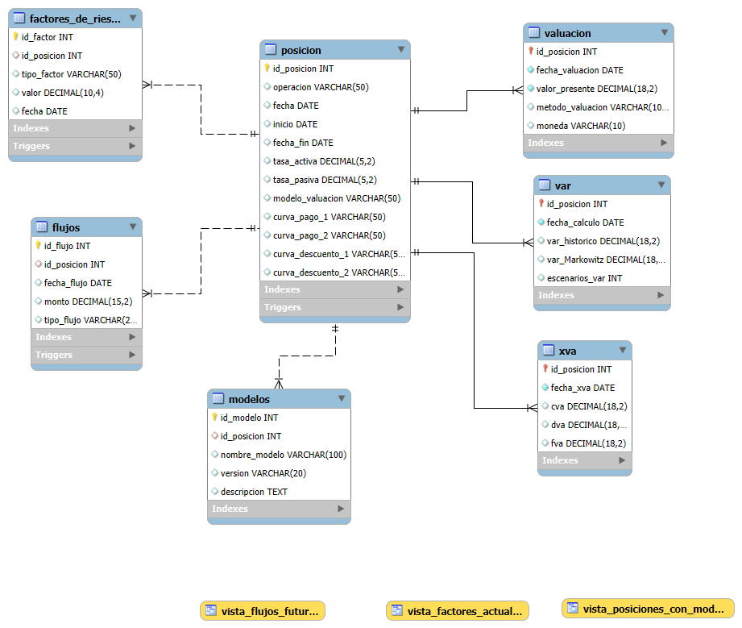

Alumno: Luis Josue Díaz Alvarez
Repositorio de la comisión 75965

# Productos financieros derivados.
## Introducción
Los productos derivados son instrumentos financieros cuyo valor depende de un activo subyacente. Su principal finalidad es transferir o reducir el riesgo asociado a dicho valor. Históricamente, los derivados pueden rastrearse hasta eventos como la especulación con los precios de los tulipanes en los Países Bajos durante los 1630, o más recientemente, la crisis financiera de 2008.

Durante esta última crisis, surgieron instrumentos como los Credit Default Swaps (CDS), que funcionaban como seguros para cubrir hipotecas. En ese entonces, los mercados confiaban plenamente en los activos inmobiliarios, al considerarse inversiones seguras, dado que las personas solían cumplir con el pago de sus hipotecas.

Sin embargo, el valor subyacente no reflejaba adecuadamente el riesgo real del mercado. Motivados por el afán de colocar más hipotecas, muchos bancos comenzaron a otorgar créditos de alto riesgo. Estos se empaquetaban y diversificaban en instrumentos conocidos como Collateralized Debt Obligations (CDO), que eran percibidos erróneamente como de bajo riesgo. Cuando las agencias calificadoras comenzaron a reducir la calificación crediticia de estos instrumentos, los seguros (CDS) se activaron. Esto generó una falta de liquidez que instituciones como Lehman Brothers no pudieron afrontar, precipitando su colapso.

La correcta valoración de instrumentos derivados, como los swaps, es fundamental, así como también lo es una adecuada estimación del valor del subyacente. En respuesta a estos riesgos, surgieron regulaciones y métricas como CVA (Credit Valuation Adjustment) y XVA, que buscan cuantificar la exposición al riesgo de contraparte en una negociación financiera.

## Objetivo
En este proyecto, desarrollamos una base de datos con la información necesaria para la valoración de derivados, así como para realizar simulaciones de riesgo utilizando métricas como VaR (Value at Risk) y CVA, bases esenciales para el cálculo de XVA. De forma resumida:

CVA (Credit Valuation Adjustment): mide el riesgo de crédito de la contraparte (probabilidad de que no me pague).

DVA (Debit Valuation Adjustment): mide el riesgo de crédito propio (probabilidad de que yo no pague).

Llegando a XVA  = CVA − DVA.

## Diagrama entidad relación 

## Base de Datos: DERIVADOS

## Descripción
La base de datos DERIVADOS modela posiciones financieras de productos derivados, sus flujos de efectivo, los factores de riesgo asociados y los modelos utilizados para su valuación. Todas las tablas se relacionan con la tabla principal `POSICION`.

---

### Entidad-Relación
- `POSICION` ← principal (PK: id_posicion)
- `FLUJOS` → relacionada con POSICION (FK: id_posicion)
- `FACTORES_DE_RIESGO` → relacionada con POSICION (FK: id_posicion)
- `MODELOS` → relacionada con POSICION (FK: id_posicion)

---

## Tablas y campos

### POSICION
| Campo               | Abreviatura   | Tipo de Dato      | Clave      |
|--------------------|---------------|-------------------|------------|
| id_posicion        | id_posicion   | INT AUTO_INCREMENT| PK         |
| operacion          | operacion     | VARCHAR(50)       |            |
| fecha              | fecha         | DATE              |            |
| inicio             | inicio        | DATE              |            |
| fecha_fin          | fecha_fin     | DATE              |            |
| tasa_activa        | tasa_activa   | DECIMAL(5,2)      |            |
| tasa_pasiva        | tasa_pasiva   | DECIMAL(5,2)      |            |
| modelo_valuacion   | modelo_valuacion | VARCHAR(50)   |            |
| curva_pago_1       | curva_pago_1  | VARCHAR(50)       |            |
| curva_pago_2       | curva_pago_2  | VARCHAR(50)       |            |
| curva_descuento_1  | curva_descuento_1 | VARCHAR(50)   |            |
| curva_descuento_2  | curva_descuento_2 | VARCHAR(50)   |            |

---

### FLUJOS
| Campo        | Tipo de Dato      | Clave |
|--------------|-------------------|-------|
| id_flujo     | INT AUTO_INCREMENT| PK    |
| id_posicion  | INT               | FK    |
| fecha_flujo  | DATE              |       |
| monto        | DECIMAL(15,2)     |       |
| tipo_flujo   | VARCHAR(20)       |       |

---

### FACTORES_DE_RIESGO
| Campo         | Tipo de Dato     | Clave |
|---------------|------------------|-------|
| id_factor     | INT AUTO_INCREMENT| PK   |
| id_posicion   | INT              | FK    |
| tipo_factor   | VARCHAR(50)      |       |
| valor         | DECIMAL(10,4)    |       |
| fecha         | DATE             |       |

---

### MODELOS
| Campo          | Tipo de Dato     | Clave |
|----------------|------------------|-------|
| id_modelo      | INT AUTO_INCREMENT| PK   |
| id_posicion    | INT              | FK    |
| nombre_modelo  | VARCHAR(100)     |       |
| version        | VARCHAR(20)      |       |
| descripcion    | TEXT             |       |

# 2da Entrega - Documentación Técnica del Proyecto DERIVADOS

## 1. Listado de Vistas

### 1.1 `vista_posiciones_con_modelo`

- **Descripción detallada**: Esta vista permite visualizar las posiciones de derivados financieras junto con la información del modelo de valuación asociado.
- **Objetivo**: Proporcionar una visualización conjunta que permita evaluar qué modelo se aplicó a cada operación.
- **Tablas utilizadas**: 
  - `POSICION`
  - `MODELOS`

---

### 1.2 `vista_flujos_futuros`

- **Descripción detallada**: Esta vista muestra todos los flujos de efectivo programados para fechas posteriores a la actual.
- **Objetivo**: Brindar una visión de los flujos pendientes, útil para la planeación de liquidez y análisis financiero.
- **Tablas utilizadas**:
  - `FLUJOS`
  - `POSICION`

---

### 1.3 `vista_factores_actuales`

- **Descripción detallada**: Muestra los factores de riesgo más recientes por tipo y posición.
- **Objetivo**: Consultar el estado actual de los factores de riesgo relevantes para el cálculo de valuaciones.
- **Tablas utilizadas**:
  - `FACTORES_DE_RIESGO`
  - `POSICION`

---

## 2. Listado de Funciones

### 2.1 `obtener_duracion_dias(fecha_inicio DATE, fecha_fin DATE)`

- **Descripción detallada**: Calcula el número de días entre dos fechas.
- **Objetivo**: Obtener la duración de una operación, útil para cálculos de intereses y métricas de riesgo.
- **Tablas utilizadas**: No accede directamente a tablas; se usa sobre datos de `POSICION`.

---

### 2.2 `calcular_spread(tasa_activa DECIMAL, tasa_pasiva DECIMAL)`

- **Descripción detallada**: Devuelve la diferencia entre la tasa activa y la tasa pasiva.
- **Objetivo**: Medir el margen financiero de una operación.
- **Tablas utilizadas**: Datos extraídos de `POSICION`.

---

### 2.3 `es_flujo_positivo(monto DECIMAL)`

- **Descripción detallada**: Evalúa si un flujo es positivo o negativo (retorna 1 o 0).
- **Objetivo**: Clasificar flujos como ingresos (positivos) o egresos (negativos).
- **Tablas utilizadas**: Aplicable a datos de `FLUJOS`.

---

## 3. Listado de Stored Procedures

### 3.1 `insertar_nueva_posicion(...)`

- **Descripción detallada**: Inserta una nueva fila en la tabla `POSICION`.
- **Objetivo**: Automatizar la inserción de datos operativos sin errores manuales.
- **Tablas involucradas**: `POSICION`

---

### 3.2 `insertar_flujo_para_posicion(id_posicion, fecha_flujo, monto, tipo_flujo)`

- **Descripción detallada**: Agrega un flujo asociado a una operación previamente registrada.
- **Objetivo**: Registrar los movimientos de caja proyectados.
- **Tablas involucradas**: `FLUJOS`, `POSICION`

---

### 3.3 `actualizar_valor_factor(id_factor, nuevo_valor)`

- **Descripción detallada**: Modifica el valor de un factor de riesgo específico.
- **Objetivo**: Mantener actualizada la base de factores con información de mercado.
- **Tablas involucradas**: `FACTORES_DE_RIESGO`

---

## 4. Triggers

### 4.1 `trg_before_insert_flujos`

- **Descripción detallada**: Evita la inserción de flujos con monto negativo.
- **Objetivo**: Asegurar la integridad del registro contable.
- **Tablas afectadas**: `FLUJOS`

---

### 4.2 `trg_after_insert_posicion`

- **Descripción detallada**: Inserta automáticamente un modelo por defecto al registrar una nueva posición.
- **Objetivo**: Asegurar que toda posición tenga un modelo asociado.
- **Tablas afectadas**: `POSICION`, `MODELOS`

---

### 4.3 `trg_before_update_factor`

- **Descripción detallada**: Audita cambios en valores de factores de riesgo (registro en log de auditoría si se implementa).
- **Objetivo**: Trazabilidad de modificaciones críticas en datos de riesgo.
- **Tablas afectadas**: `FACTORES_DE_RIESGO`

